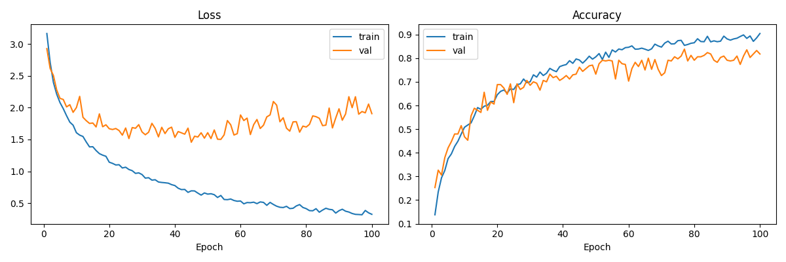
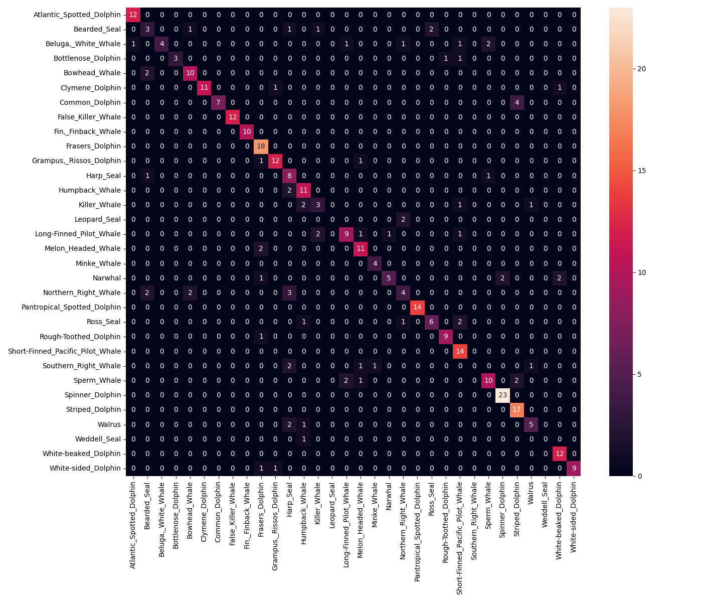
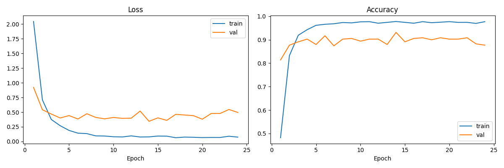
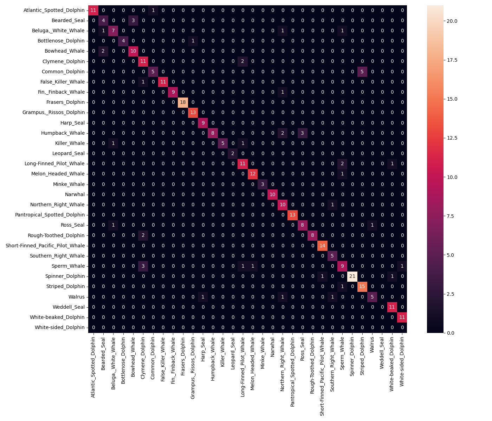
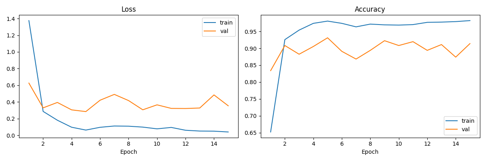
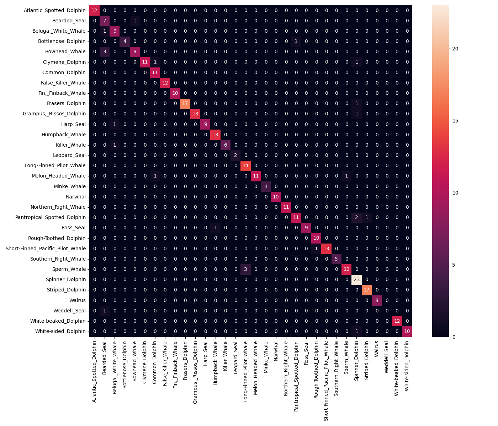

# marine-mammal-sound-classifier

Automated detection and classification of marine mammals from passive underwater acoustic recordings. Deep learning pipeline trained on the Watkins Marine Mammal Sound Database (32 species). Extensible toward naval underwater acoustic surveillance and submarine threat discrimination.

---

## Motivation & Applications

Passive acoustic monitoring is one of the most effective methods for underwater surveillance — unlike active sonar, it emits no signal and cannot be detected. In naval environments, the ability to automatically distinguish biological acoustic sources from anthropogenic ones is operationally critical.

A submarine or underwater sensor array continuously receives acoustic signals from its environment. Marine mammals — whales, dolphins, seals — generate powerful, species-specific vocalizations that can mask or be confused with vessel signatures, torpedoes, or other threats. Misclassifying a humpback whale as a contact is a costly false positive; failing to detect a contact behind biological noise is worse.

This project explores whether deep learning classifiers trained on labeled bioacoustic data can reliably identify marine mammal species from raw acoustic recordings. With a sufficiently large and diverse dataset, such a classifier could serve as a biological noise filter in a passive sonar processing pipeline — isolating non-biological signals for further analysis.

---

## Results

| Model | Val Accuracy | Val Weighted F1 |
|---|---|---|
| CNN Scratch | 79% | 0.78 |
| ResNet18 | 93% | 0.93 |
| AST (Audio Spectrogram Transformer) | 93% | 0.93 |

---

## Dataset

**Watkins Marine Mammal Sound Database** — Woods Hole Oceanographic Institution & New Bedford Whaling Museum.

~1,700 labeled audio clips across 32 species of marine mammals (dolphins, whales, seals), spanning 7 decades of recordings. Accessed via [Hugging Face](https://huggingface.co/datasets/confit/wmms-parquet).

Species include: Atlantic Spotted Dolphin, Bearded Seal, Beluga White Whale, Bottlenose Dolphin, Bowhead Whale, Clymene Dolphin, Common Dolphin, False Killer Whale, Fin Whale, Frasers Dolphin, Grampus Rissos Dolphin, Harp Seal, Humpback Whale, Killer Whale, Leopard Seal, Long-Finned Pilot Whale, Melon Headed Whale, Minke Whale, Narwhal, Northern Right Whale, Pantropical Spotted Dolphin, Ross Seal, Rough-Toothed Dolphin, Short-Finned Pacific Pilot Whale, Southern Right Whale, Sperm Whale, Spinner Dolphin, Striped Dolphin, Walrus, Weddell Seal, White-beaked Dolphin, White-sided Dolphin.

The data is split 80/20 per species (stratified) to guarantee all species appear in both train and test sets.

> Credit: *Watkins Marine Mammal Sound Database, Woods Hole Oceanographic Institution and the New Bedford Whaling Museum.*

---

## Pipeline

All models share the same preprocessing pipeline conceptually, though the feature extraction differs.

### CNN Scratch & ResNet18
```
WAV file → Mel-Spectrogram (librosa/torchaudio) → AmplitudeToDB → (1, 64, 256) tensor → CNN
```

Audio is loaded with `soundfile`, converted to a mel-spectrogram (64 mel bands, 256 time frames), and treated as a grayscale image fed into a CNN.

### AST (Audio Spectrogram Transformer)
```
WAV file → Resample to 16kHz → ASTFeatureExtractor → Transformer → 32 classes
```

Audio is resampled to 16kHz and processed by HuggingFace's `ASTFeatureExtractor` (128 mel bins, normalized), then passed to the transformer.

---

## Models

### 1. CNN Scratch
A custom 3-block convolutional network built from scratch.

Architecture: 3× (Conv2d → BatchNorm → ReLU → MaxPool) → AdaptiveAvgPool → Linear(128→64) → Dropout(0.3) → Linear(64→32)

Trained for 150 epochs, lr=1e-4, batch size 32.

**Learning curves:**



**Confusion matrix:**



---

### 2. ResNet18 (fine-tuned)
ResNet18 pre-trained on ImageNet, adapted for single-channel mel-spectrograms.

The first conv layer is replaced to accept 1 channel (grayscale) instead of 3 (RGB), and the final fully connected layer is replaced for 32 classes. Despite being pre-trained on images, the learned low-level features (edges, textures) transfer well to spectrogram patterns.

Trained with early stopping (patience=10), lr=1e-4, batch size 32.

**Learning curves:**



**Confusion matrix:**



---

### 3. AST — Audio Spectrogram Transformer (fine-tuned)
`MIT/ast-finetuned-audioset-10-10-0.4593` from HuggingFace, pre-trained on AudioSet (2M audio clips, 527 classes).

AST applies a Vision Transformer (ViT) architecture directly to mel-spectrograms: the spectrogram is split into patches which are processed by a transformer encoder. Unlike ResNet18, this model was pre-trained on audio data, giving it acoustically meaningful representations from the start. Only the classification head (527→32 classes) is reinitialized.

Trained with early stopping (patience=10), lr=1e-4, batch size 32. Converged in ~15 epochs.

**Learning curves:**



**Confusion matrix:**



---

## Project Structure

```
marine-mammal-sound-classifier/
├── data/
│   ├── train/          # 80% per species (stratified)
│   └── test/           # 20% per species (stratified)
├── src/
│   ├── dataset_cnn.py          # PyTorch Dataset — mel-spectrogram
│   ├── dataset_ast.py          # PyTorch Dataset — raw waveform for AST
│   ├── model_cnn_scratch.py    # Custom CNN
│   ├── model_resnet18.py       # ResNet18 fine-tuned
│   ├── model_ast.py            # AST fine-tuned
│   ├── train.py                # Training loop (--model, --epochs, --patience)
│   └── evaluate.py             # Metrics + confusion matrix
├── outputs/
│   ├── cnn_scratch/    # model.pt, curves.png, confusion_matrix.png, history.json
│   ├── resnet18/
│   └── ast/
├── .gitattributes      # Git LFS tracking for *.pt
├── .gitignore
└── README.md
```

---

## Setup

```bash
pip install datasets soundfile torchaudio torchvision transformers librosa scikit-learn seaborn matplotlib tqdm
```

Download and prepare the dataset (stratified 80/20 split per species):
```bash
python src/load_data.py
```

Train a model:
```bash
python src/train.py --model cnn_scratch --epochs 150
python src/train.py --model resnet18 --epochs 50 --patience 10
python src/train.py --model ast --epochs 50 --patience 10
```

Evaluate:
```bash
python src/evaluate.py --model ast
```

---

## Discussion

The stratified split was critical — the original HuggingFace train/test split left some species entirely absent from the test set, causing label index mismatches and artificially deflated metrics.

CNN scratch plateaus around 79% after 150 epochs with no sign of overfitting, suggesting the architecture is underpowered for this task rather than overfit. ResNet18 and AST both reach 93% with early stopping around epoch 24 and 15 respectively, confirming that pre-trained representations (whether from images or audio) significantly outperform training from scratch on this small dataset.

The main remaining challenge is class imbalance — some species have very few samples (Weddell Seal: 1 test sample, Leopard Seal: 2), making reliable evaluation difficult for those classes. Extending the dataset with the full Watkins "All Cuts" collection (14,767 samples) would be the most impactful next step.
